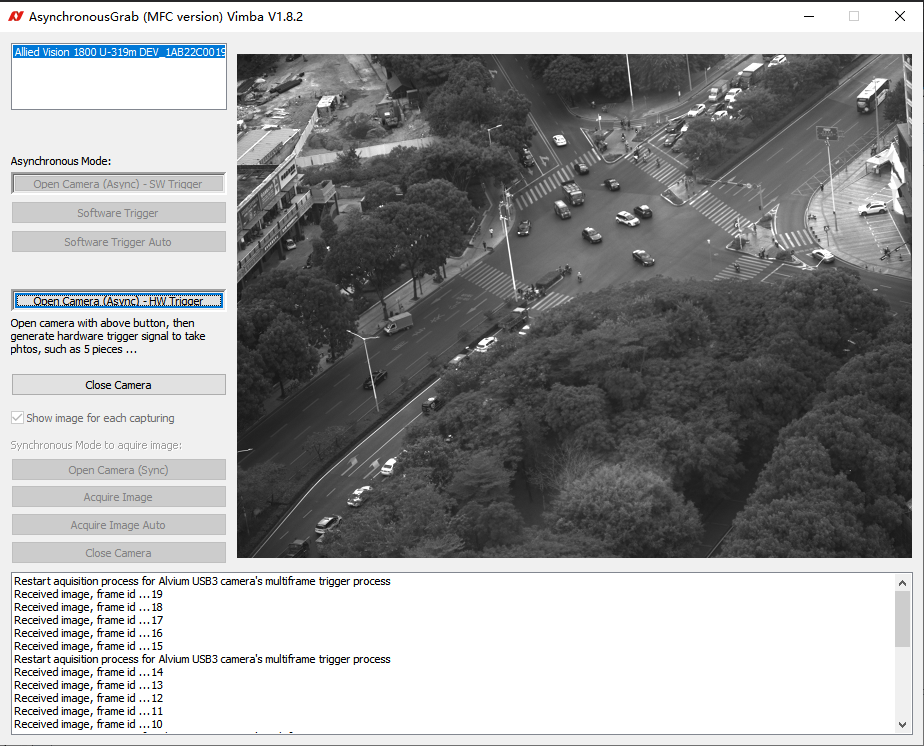

# vimba4_mfc_hardware_trigger_multiple_photos_acquire_image_loop

## Introduction
One hardware trigger to get multiple photos.   
For example, one hardware trigger in line 0, 5 pieces photos will emit out from Alvium U-319m camera or Manta etc.,.

## Screenshot
